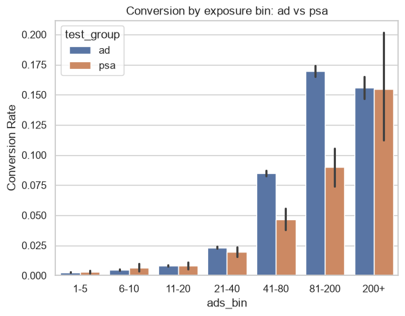
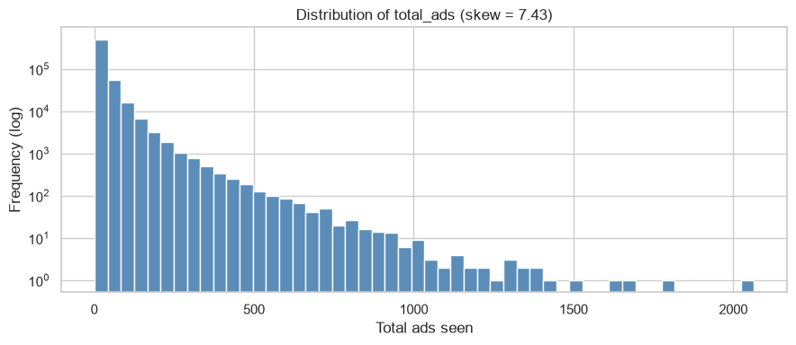

# Marketing A/B Test | Conversion Analysis

A/B test analysis on the Kaggle marketing dataset (`faviovaz/marketing-ab-testing`). Users are assigned to an `ad` treatment or a `psa` control, and the analysis estimates the effect of the campaign on conversion rate while accounting for exposure volume and time of exposure.

## Project structure

```
marketing-ab-test/
├── README.md
├── requirements.txt
├── assets/
└── notebooks/
    └── ab_test_analysis.ipynb
```

The dataset is pulled at runtime via `kagglehub`, so no local copy is needed.

## Requirements

- Python 3.10+
- R 4.x with packages: `emmeans`, `car`, `dplyr` (called from the notebook via `rpy2`)
- Kaggle credentials configured for `kagglehub`

Install Python dependencies:

```bash
pip install -r requirements.txt
```

R packages, from an R session:

```r
install.packages(c("emmeans", "car", "dplyr"))
```

## Dataset

`marketing_AB.csv` contains one row per user with:

- `test_group`: `ad` (treatment) or `psa` (control).
- `converted`: boolean outcome.
- `total_ads`: number of ads seen by the user.
- `most_ads_day`: day of week with peak exposure.
- `most_ads_hour`: hour with peak exposure (0–23).

The allocation is deliberately unbalanced: ~96% of users are in `ad`, ~4% in `psa`. Mean and median exposure are comparable across groups (ad: mean 24.8, median 13; psa: mean 24.8, median 12), but the distribution is strongly right-skewed (skew ≈ 7.4, max 2065), so the tail contains few users with very high impression counts. For the descriptive breakdowns, `total_ads` is discretized into seven bins (`1-5`, `6-10`, `11-20`, `21-40`, `41-80`, `81-200`, `200+`). For the model, it enters as `log1p(total_ads)`.

## Workflow

1. Load the CSV with `kagglehub`, drop the unnamed index column, rename columns to snake_case.
2. Bin `total_ads` into `ads_bin`.
3. Compute descriptives: group sizes, exposure summaries, raw conversion rates by group, by day, and by exposure bin.
4. Two-proportion z-test comparing `ad` vs `psa` on the aggregate conversion rate.
5. Descriptive plots: hour of day, day × group, dose-response by exposure bin.
6. Logistic GLM in R via `rpy2`: `converted ~ log_total_ads + test_group + most_ads_hour * most_ads_day`, family binomial. Type-III `Anova`, `emmeans` marginal means, Tukey-adjusted pairwise contrasts filtered at `p < 0.05`.
7. Heatmap of predicted conversion rate from the `emmeans` output, arranged as `day × hour`.

## Statistical analysis

### Two-proportion z-test

H0: `P(convert | ad) = P(convert | psa)`. The test is run on the aggregate 2×2 table using `statsmodels.stats.proportion.proportions_ztest`. The observed lift and p-value are printed by the notebook. Given the sample size, even a small absolute difference will be significant, so the size of the lift is the relevant quantity, not the p-value.

The z-test ignores exposure and timing, which are unbalanced across groups (see the dose-response plot below). The GLM is meant to address this.

### Logistic GLM

```
converted ~ log_total_ads + test_group + most_ads_hour * most_ads_day
```

`log1p` is applied because `total_ads` is right-skewed and includes zero. Type-III `Anova` gives the marginal contribution of each term with the others held in the model, including the interaction. `emmeans` returns predicted probabilities per `most_ads_hour × most_ads_day` cell, and `pairs()` with Tukey adjustment isolates cells that differ significantly at α = 0.05.

## Plots

### Conversion rate by hour of day


Descriptive bar chart, 24 bars, collapsed over group and day. Rate is lowest around 02:00 (~0.75%), rises through the morning, and stays roughly between 2.5% and 3% from 14:00 to 21:00. The peak sits at 16:00 (~3.1%), highlighted in red, but hours 15, 17, 20 and 21 are essentially within noise of the peak. Confidence intervals in the very early hours (04–05) are wide, because few users have their peak exposure there.

### Conversion rate by day of week × group


Grouped bar chart. `ad` is above `psa` on every day, but the gap and its clarity vary:

- Monday and Tuesday show the largest separation and the highest rates for `ad` (~3.3% and ~3.0%).
- Wednesday, Friday, Saturday show a clear but smaller gap.
- Thursday and Sunday: point estimates are close and the CIs overlap; the treatment effect is not clean on these days.

The pattern is consistent with a treatment effect present across the week but weaker on Thu/Sun. This is descriptive and does not adjust for exposure.

### Dose-response, `ad` group only


Line for conversion rate by `ads_bin`, bars for user counts on the secondary axis. Conversion rises steeply with exposure (from ~0.2% at 1–5 to ~17% at 81–200) and then drops slightly at 200+ (~15.5%). The 200+ bin holds few users, so the drop is likely noise rather than a real ceiling. User count is heavily concentrated in the low bins, so the aggregate rate is dominated by users with little exposure.

### Dose-response by group with 95% CIs



Both groups show a monotonic dose-response. The `ad` group is ahead of `psa` only in the mid-to-high bins (41–80 and 81–200). Below 40 ads the two groups are indistinguishable, and at 200+ the `psa` CI widens due to small n and the point estimates converge. The treatment effect is concentrated in a specific exposure window, not uniform across the range.

### Distribution of `total_ads`



Histogram with log-scaled y-axis. Skew ≈ 7.4. Almost all mass sits near zero; the tail extends past 2000 with single-user bins. This motivates both the binning used for descriptives and the `log1p` transform used in the GLM.

### Predicted conversion heatmap (hour × day)

Heatmap of `emmeans` predictions pivoted into a `day × hour` grid. Unlike the raw hour-of-day chart, this controls for `log_total_ads` and `test_group`, so the highlighted cells reflect timing effects net of exposure and group.

## Interpretation

- The `ad` group has higher conversion than `psa` in aggregate, but the difference is not uniform. It is clear on Mon–Wed and Fri–Sat, and unclear on Thu and Sun.
- Exposure is a strong predictor of conversion. Both groups follow the same shape, so a large part of the raw group difference is attributable to exposure rather than to the treatment.
- The lift attributable to the ad campaign, beyond exposure, is concentrated in the 41–200 range of `total_ads`. Below 40 ads the two groups are indistinguishable; above 200 the estimates are unstable.
- Timing effects visible in the raw hour chart may reflect exposure patterns rather than a pure hour effect. The GLM heatmap and the filtered Tukey contrasts are the outputs to consult for that question.

## Limitations

- The 96/4 split is not a balanced A/B allocation. `psa` estimates carry higher variance, and finer breakdowns (day × hour cells) are noisy for the control group.
- `total_ads` is post-treatment. It reflects delivery policy and user behavior together. Conditioning on it in the GLM controls for exposure but is open to collider bias if unmeasured factors drive both exposure and conversion.
- Timing is recorded only as peak hour and peak day. Recency, frequency capping and fatigue cannot be modeled from these features.
- Conversion is a binary outcome with no monetary value attached. A lift in conversion rate is not a lift in revenue.
