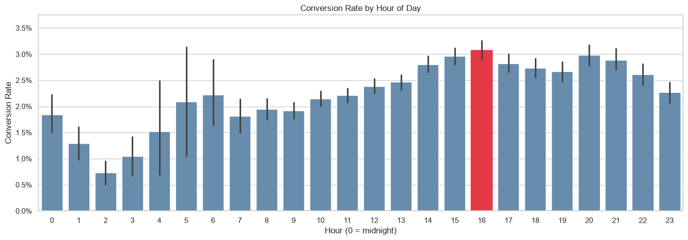
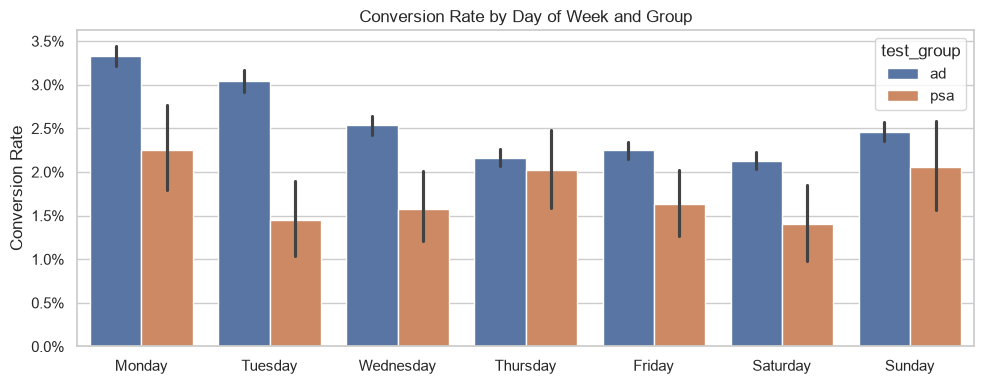
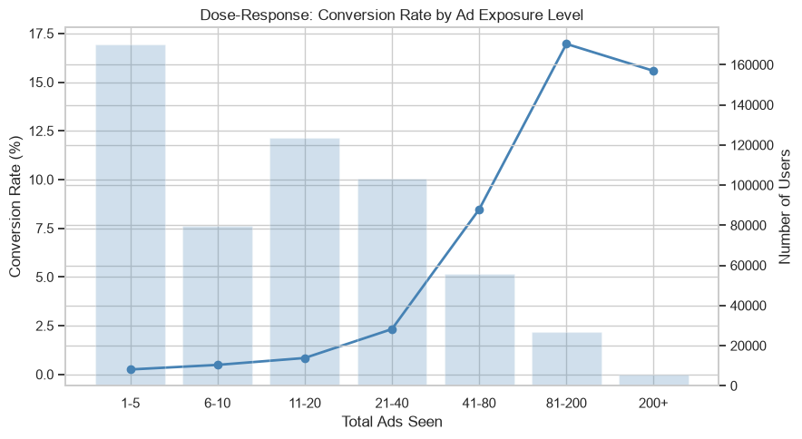

# Marketing A/B Test | Conversion Analysis

A/B test analysis on the Kaggle marketing dataset (`faviovaz/marketing-ab-testing`). Users are split between an `ad` treatment and a `psa` control; the analysis quantifies the lift in conversion rate and checks how exposure volume and timing affect it.

## Project structure

```
marketing-ab-test/
├── README.md
├── requirements.txt
├── assets/
└── notebooks/
    └── ab_test_analysis.ipynb
```

The dataset is pulled at runtime via `kagglehub`, so no local copy is needed.

## Requirements

- Python 3.10+
- R 4.x with packages: `emmeans`, `car`, `dplyr` (used inside the notebook via `rpy2`)
- Kaggle account credentials configured for `kagglehub`

Install Python dependencies:

```bash
pip install -r requirements.txt
```

R packages (from an R session):

```r
install.packages(c("emmeans", "car", "dplyr"))
```

## Dataset

The Kaggle `marketing_AB.csv` file contains one row per user with:

- `test_group` — `ad` (treatment) or `psa` (control).
- `converted` — boolean outcome.
- `total_ads` — number of ads seen by the user.
- `most_ads_day` — day of week with peak exposure.
- `most_ads_hour` — hour with peak exposure (0–23).

Groups are imbalanced by design: ~96% `ad`, ~4% `psa`. `total_ads` is strongly right-skewed (max 2065), so it's binned into 7 categories (`1-5`, `6-10`, ..., `200+`) and also log-transformed (`log1p`) before entering the model.

## Workflow

1. **Load and rename.** Pull the dataset with `kagglehub`, drop the unnamed index column, rename to snake_case so the columns work with `statsmodels` and R formula APIs.
2. **Bin exposure.** Discretize `total_ads` into `ads_bin` for descriptive breakdowns and dose-response plots.
3. **Descriptives.** Group sizes, exposure summaries, and raw conversion rates by group, by day, and by exposure bin.
4. **Primary test.** Two-proportion z-test on `ad` vs `psa` conversion.
5. **Visualization.** Hour-of-day, day × group, dose-response, and total-ads distribution.
6. **Interaction model.** Logistic GLM in R via `rpy2` with `log_total_ads + test_group + most_ads_hour * most_ads_day`, Type-III `Anova`, `emmeans` marginal means, Tukey-adjusted pairwise contrasts.
7. **Heatmap.** Predicted conversion rate across hour × day from the fitted model.

## Statistical results

### Two-proportion z-test

H0: `P(convert | ad) = P(convert | psa)`. The z-test on the aggregate 2×2 table gives a significant positive lift for the ad group (roughly +0.8 pp absolute, ~+40% relative). With the sample size involved, even a small absolute effect clears significance easily, so the practical takeaway is the size of the lift, not the p-value.

Caveat: the z-test ignores exposure and timing. Users in the ad group with 200+ impressions are not comparable to psa users with 5. The GLM addresses this.

### Logistic GLM

The model:

```
converted ~ log_total_ads + test_group + most_ads_hour * most_ads_day
```

`log_total_ads` uses `log1p` because `total_ads` is right-skewed and includes zeros. Type-III `Anova` reports the marginal contribution of each term controlling for the others, including the interaction.

Expected pattern from the omnibus tests:
- `log_total_ads`: strong positive effect. More exposure, higher conversion probability.
- `test_group`: positive treatment effect that shrinks compared to the raw z-test once exposure is controlled for.
- `most_ads_hour * most_ads_day`: significant interaction. Conversion is not just higher on certain days or certain hours in isolation; specific hour × day cells drive the effect.

### Post-hoc contrasts

`emmeans` returns predicted probabilities per hour × day cell. Pairwise contrasts with Tukey adjustment are filtered to `p < 0.05` and stored in `significant_pairs`. This isolates which specific timing cells differ, rather than reading tea leaves off the heatmap.

## Plots

### Conversion rate by hour of day



Bar chart, one bar per hour, 0–23, with hour 16 highlighted. Shows a clear diurnal pattern: conversion climbs through the morning, peaks in mid-to-late afternoon (16:00), and drops overnight. Purely descriptive — collapses over group and day.

### Conversion rate by day of week × group



Grouped bar chart, `ad` vs `psa` per day. Two things to read: the day-level pattern (higher on Mondays/Tuesdays) and the group gap within each day. The gap is visible on every day, consistent with a treatment effect that isn't confined to one part of the week.

### Dose-response, ad group only



Line-plus-bar chart. Line is conversion rate by `ads_bin`; bars are user counts. The rate rises with exposure but the user count crashes: most users fall in the low-exposure bins, and the high-exposure bins have small samples. Reads as a strong monotonic dose-response with wide uncertainty at the tail.

### Dose-response by group with 95% CIs

Grouped bar chart of conversion rate per `ads_bin`, split by group, with bootstrap CIs. Confirms the pattern holds when psa is included as a benchmark: the ad group's rate rises with exposure while psa stays roughly flat, and the gap widens with more impressions.

### Distribution of `total_ads`

Histogram with log-scaled y-axis. Justifies the log transform and the binning: a hard mode near zero and a long thin tail extending past 2000.

### Predicted conversion heatmap (hour × day)

Model-adjusted `emmeans` output pivoted into a `day × hour` grid. Unlike the raw hour-of-day bar chart, this controls for `log_total_ads` and `test_group`, so hotspots reflect timing effects net of exposure. Bright cells identify the hour × day combinations where the model expects the highest conversion probability.

## Interpretation

- The ad campaign has a real positive effect on conversion, but the raw z-test overstates it because exposure is unbalanced across groups.
- Exposure is the strongest predictor: higher `total_ads` maps monotonically to higher conversion, with diminishing sample support at the extreme.
- Timing matters and doesn't decompose cleanly into "best day" and "best hour" independently. The interaction is where the signal is. Use the `significant_pairs` output to pick specific delivery windows rather than reading marginal effects.

## Limitations

- The 96/4 split is not a fair A/B allocation. Estimates for psa carry more variance and small-sample noise dominates finer breakdowns.
- `total_ads` is post-treatment: it partly reflects targeting and user behavior, not just campaign policy. Conditioning on it, as the GLM does, controls for exposure but risks collider bias if unmeasured factors affect both exposure and conversion.
- The dataset has no timestamps beyond peak hour and day. There is no way to model recency, frequency capping, or fatigue directly.
- Conversion is a boolean without value. Lift in conversion rate is not lift in revenue.
